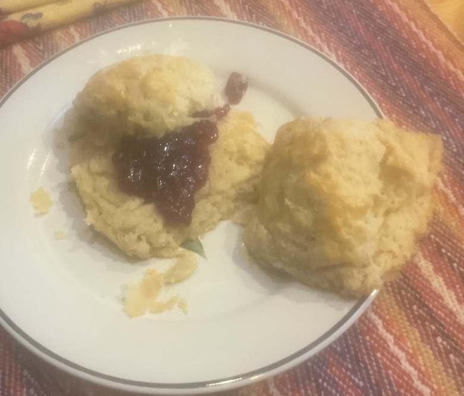

[prev](lithuania.md)&emsp;
[top](../index.md)&emsp;
[next](../m/madagascar.md)
# Luxembourg
<meta property="og:image" content="images/luxembourg.png"/>
21 May, 2023

Luxembourgish breakfast: gebeesseschmier. Basically, it's just bread
and jam, but I used this as an opportunity to try making croissants, a
popular choice. It did not go well. I have to try the recipe again. I
think I learned what not to do this time.

Jam was lingonberry, a household favorite.

Recipe for the croissants was from "Baking with Julia", by Julia Child.

