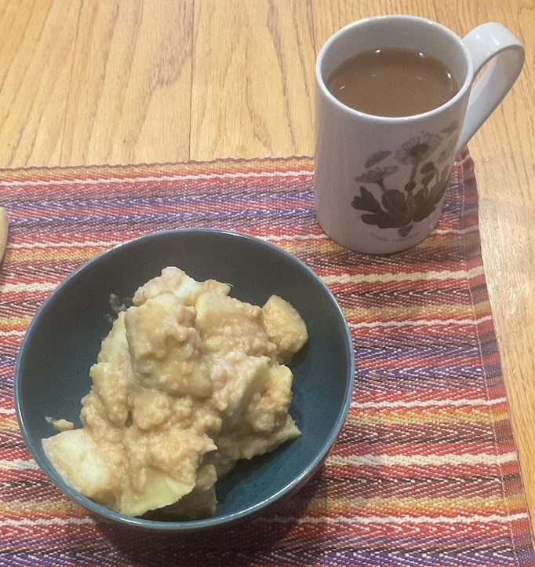

[prev](madagascar.md)&emsp;
[top](../index.md)&emsp;
# Malawi
<meta property="og:image" content="images/malawi.png"/>
4 June, 2023

Malawian breakfast: futali. This is often served with greens, marked
optional in the recipe. I cannot eat cooked greans, so I left them
out. The result was bland and uninteresting. I think the greens could
have made it a much better dish, but the version I had was not very
interesting or enjoyable. (I may have overcooked the sweet potato
also, it was mushier than I expected from the photo in the recipe.)

[recipe](https://afrogistmedia.com/futali-recipe-a-healthy-malawian-breakfast)

