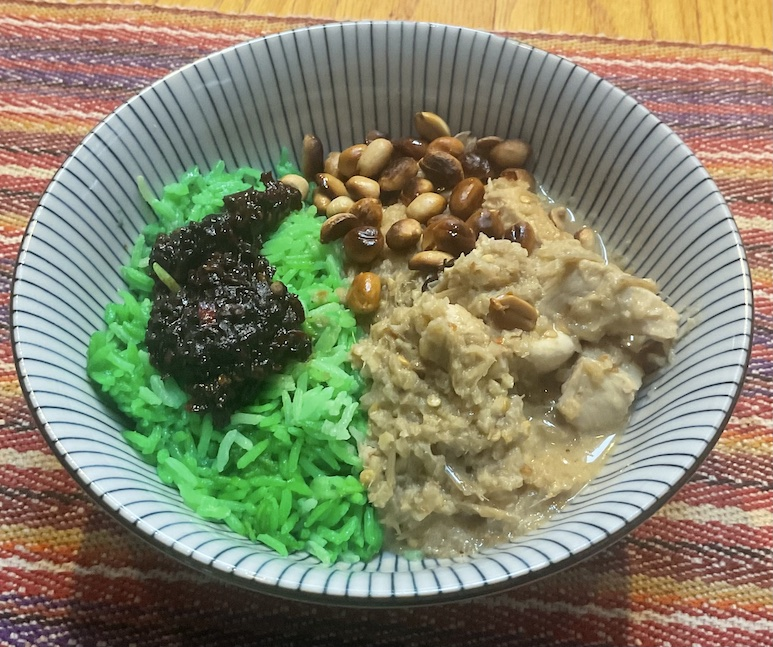

[prev](malawi.md)&emsp;
[top](../index.md)&emsp;
[next](maldives.md)
# Malaysia
11 June, 2023

Malaysian breakfast: Nasi Lemak, sambal, fried peanuts, chicken
rendang. This was a huge breakfast, we were both quite full when we
left the table. The sambal was a little spicy for my wife, but I loved
it. I had to substitue pandang extract for the pandang leaves, which
is why my rice is green.

Recipes: 
[nasi lemak](https://www.nyonyacooking.com/recipes/nasi-lemak~BynkuvoPf9-X) 
[sambal](https://www.nyonyacooking.com/recipes/sambal-nasi-lemak~HkVJdwiPMcZ7) 
[chicken rendang](https://rasamalaysia.com/chicken-rendang/) 

