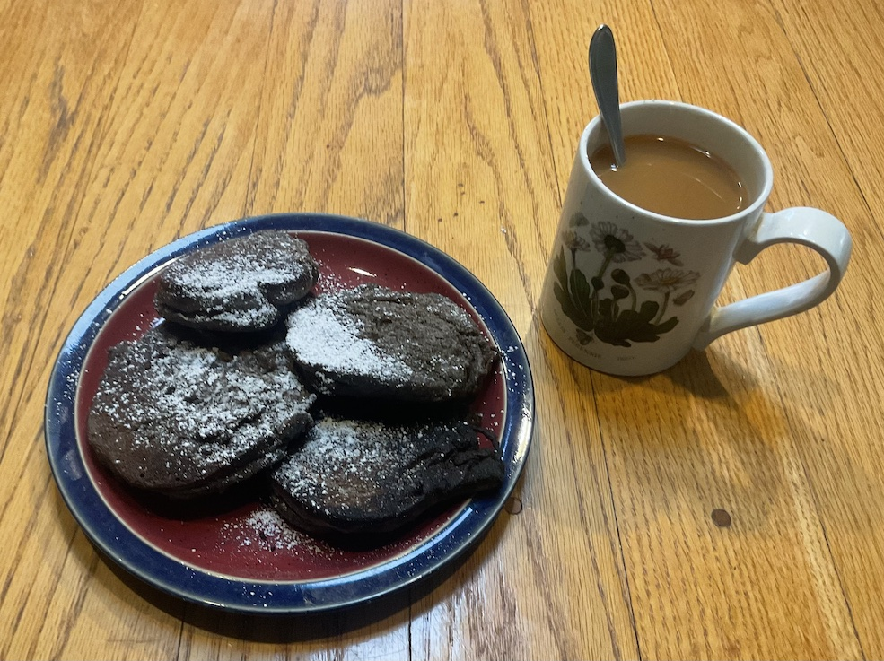

[prev](maldives.md)&emsp;
[top](../index.md)&emsp;
# Mali
<meta property="og:image" content="images/mali.png"/>
25 June, 2023

Malian breakfast: maasa. I substituted buckwheat flour for the
millet flour, which is why mine are so dark. That made them
essentially buckwheat pancakes. Very tasty, though not that novel for
me.

[recipe](https://food52.com/recipes/16994-maasa-from-mali-gluten-free-pancake-doughnuts)

