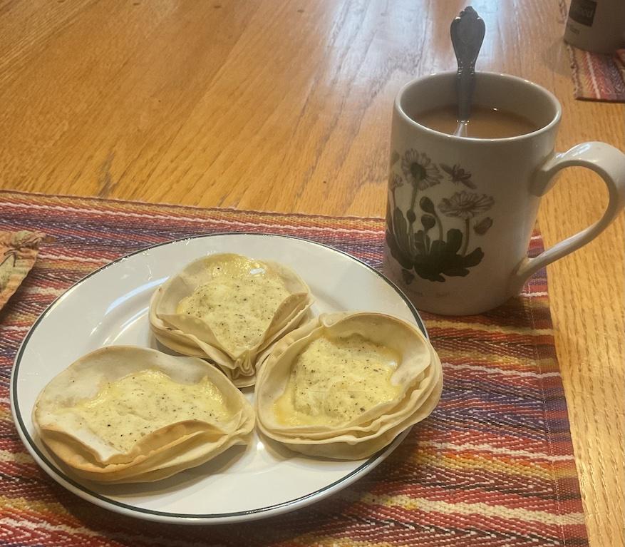

[prev](mali.md)&emsp;
[top](../index.md)&emsp;
[next](marshall_islands.md)
# Malta
<meta property="og:image" content="images/malta.png"/>
2 July, 2023

Maltese breakfast: pastizzi. These were very good. Very rich, though.  Three apiece was plenty to keep us going. Mine sort of flattened out during the baking; they're supposed tobe sort of canoe shaped.

These reminded me a lot of [my finnish breakfast dish](../f/finland.html).

Recipes: 
[phyllo dough](https://www.thespruceeats.com/homemade-phyllo-dough-1705600) 
[pastizzi](https://nofrillskitchen.com/pastizzi-recipe/)

