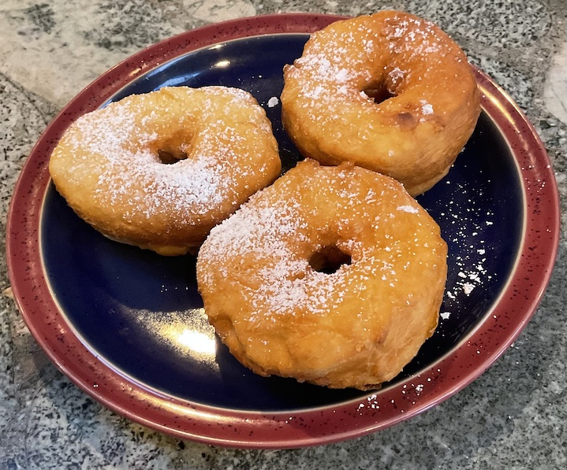

[prev](malta.md)&emsp;
[top](../index.md)&emsp;
[next](mauritania.md)
# Marshall Islands
<meta property="og:image" content="images/marshall_islands.png"/>
9 July, 2023

Marshallese breakfast: Donat. Pretty much just doughnuts. Very tasty,
but the recipe was a bit of a challenge to follow. I think there's too
much water in it, because I got a batter instead of a dough, and it
was impossible to roll out without adding more flour.

Also, they say it's three per serving, but my wife and I could only
eat three between us.

[recipe](https://charlieenoch.wordpress.com/2015/04/13/how-to-make-marshallese-donuts/)

