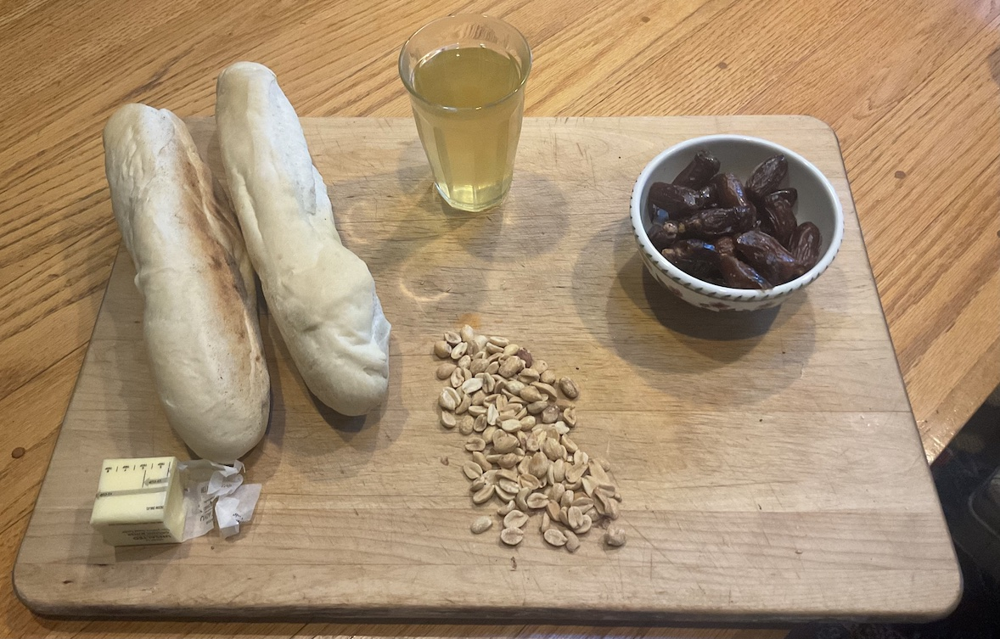

[prev](marshall_islands.md)&emsp;
[top](../index.md)&emsp;
[next](mauritius.md)
# Mauritania
<meta property="og:image" content="images/mauritania.png"/>
16 July, 2023

Mauritanian breakfast: mbourou wetay.  Baguettes with butter, dates,
peanuts, and green mint tea. Pretty straightforward to make, very
satisfying.  The tea was amazing, will definitely make that again. I
think I had the wrong kind of green tea, though, because I could not
get the foam to form.

[tea recipe](https://youtu.be/7fLHtn2wQYA) 
[baguettes](https://www.peterandrewryan.com/baking/2008/08/french-baguettes/)

