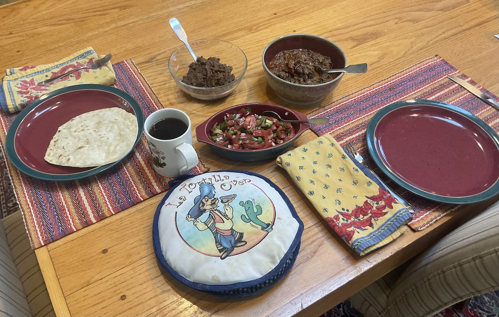

[prev](mauritius.md)&emsp;
[top](../index.md)&emsp;
[next](micronesia.md)
# Mexico
30 July, 2023

Mexican breakfast: machaca, with refried beans, salsa fresca, flour
tortillas. This took a long time to make, but the results were
amazing. A little frantic in the kitchen when everything got done at
the same time, trying to cook the tortillas while shredding the
beef. Why do I do this to myself?

Recipes: 
[machaca](http://mexicofoodandmore.com/meat/beef/machaca-recipe.html) 
[tortillas](https://www.tasteofhome.com/recipes/homemade-tortillas/) 
[refried beans](https://chefsavvy.com/refried-black-beans/) 
[salsa fresca](https://www.177milkstreet.com/recipes/salsa-fresca)

