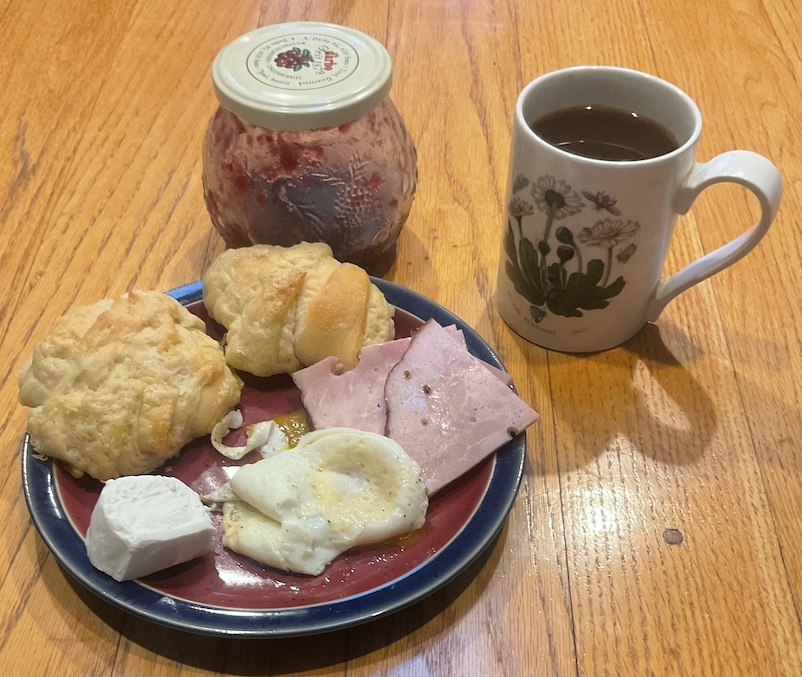

[prev](moldova.md)&emsp;
[top](../index.md)&emsp;
# Monaco
<meta property="og:image" content="images/monaco.png"/>
20 August, 2023

Mon&eacute;gasque breakfast: croissants, goat cheese, ham, fried egg,
coffee. I try to avoid the bread and cheese thing for this project,
because it feels lazy, and it could be applied to so many different
countries. The point here is diversity.  However, I had a terrible
time finding any information about Monaco breakfasts, so I finally
implemented the one thing I could find.

This is my second attempt at making croissants. The only two good
things to say are: they were better than the first attempt, and they
tasted fine.

No recipes this week. The croissants were from Julia Child.

