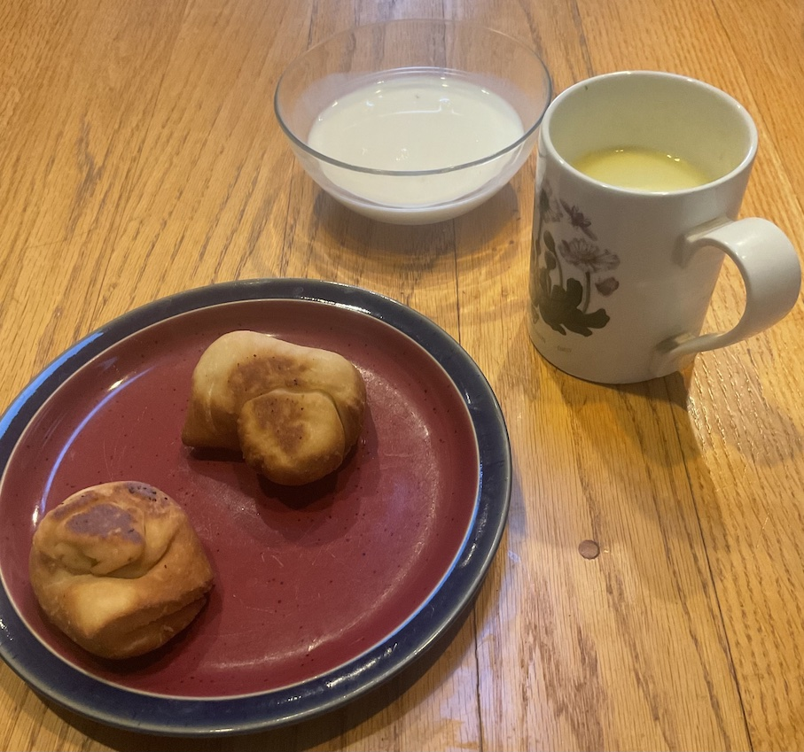

[prev](monaco.md)&emsp;
[top](../index.md)&emsp;
[next](montenegro.md)
# Mongolia
<meta property="og:image" content="images/mongolia.png"/>
27 August, 2023

Mongoliian breakfast: milk tea, boortsorg, urum. The urum turned out
to be just a bowl of milk. My wife thinks the recipe won't work with
pasturized milk, and she's probably right. The tea was very good, as
were the boortsorg, and dipping them in the milk definitely improved
them.  Overall, this was a fun one.

Recipes 
[milk tea](https://www.innatthecrossroads.com/mongolian-milk-tea/) 
[boortsorg](https://www.internationalcuisine.com/mongolian-butter-cookies/) 
[urum](https://www.mongolfood.info/en/recipes/urum.html)

