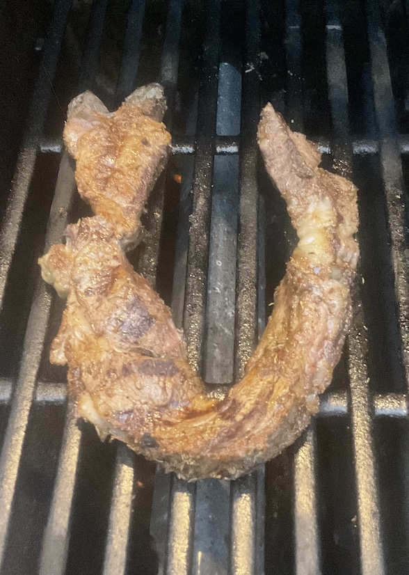

[prev](../m/myanmar.md)&emsp;
[top](../index.md)&emsp;
[next](nauru.md)
# Namibia
1 October, 2023

Namibian breakfast: kapana. This is a street food that is commonly
eaten for breakfast, though not as an everyday meal.  It's basically a
rope of steak that's been seasoned and grilled, but the spice mix was
amazing. Very satisfying breakfast.

[recipe](https://www.esterkocht.com/kapana-recipe-grilled-beef-authentic-namibian-street-food/)

