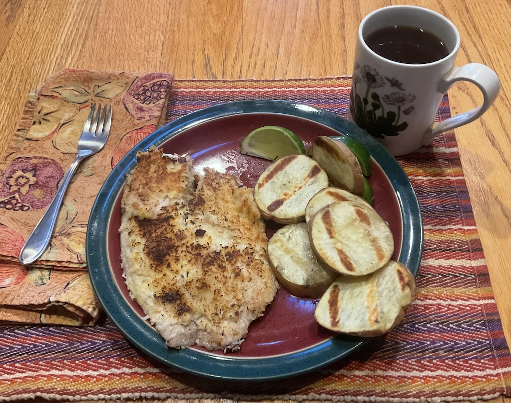

[prev](namibia.md)&emsp;
[top](../index.md)&emsp;
[next](nepal.md)
# Nauru
8 October, 2023

Nauran breakfast: grilled talapia and grilled sweet potatoes. The
talapia were encrusted in grated coconut, then drizzled with lime
juice.  A very tasty breakfast, though I made way too much. I think if
I made this again I would use mahi mahi in place of the talapia.

Recipes: 
[chatty info](https://foodnerdy.com/blog/what-are-the-typical-breakfast-options-in-nauru/) 
[fish](https://www.internationalcuisine.com/nauru-coconut-crusted-fish/) 
[sweet potato](https://www.thekitchn.com/easy-grilled-sweet-potatoes-259040) 

