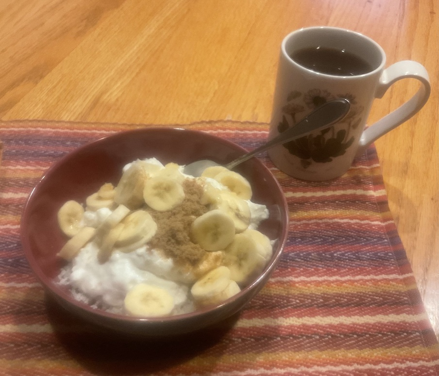

[prev](nauru.md)&emsp;
[top](../index.md)&emsp;
[next](netherlands.md)
# Nepal
15 October, 2023

Nepali breakfast: dahi-chiura. Aside from making the flattened rice,
this was about as complicated as pouring a bowl of breakfast
cereal. Taste was surprisingly good for such a simple concept. Alas,
both my wife and I were hungry before lunch time; maybe supplement
with some other items.

Sorry for the crappy photo; I couldn't get my camera to focus.

Recipes: 
[flattened rice](https://www.healthshots.com/how-to/want-to-make-poha-from-scratch-heres-how-to-make-it-using-rice/) 
[dahi-chiura](https://virtualnepali.com/dahi-chiura-recipe-delicious-mix-of-yogurt-beaten-rice/) 

