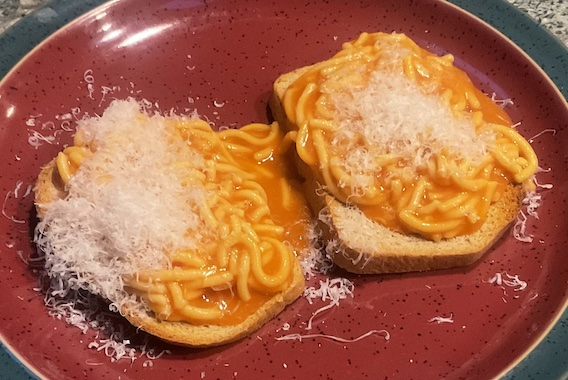

[prev](netherlands.md)&emsp;
[top](../index.md)&emsp;
[next](nicaragua.md)
# New Zealand
<meta property="og:image" content="images/new_zealand.png"/>
29 October, 2023

New Zealand breakfast: canned spaghetti on toast. This was a strange
one for me. I didn't like it as much as I expected to, but I think it
would be a great hangover breakfast. It's been a long time since I had
canned spaghetti, and I think my tastes have changed a lot since those
days.  On the plus side, this was one of the easiest breakfasts I've
ever made.

The "recipe" is way off; 400 grams of spaghetti is definitely enough
for two servings.

["recipe"](https://www.tasteatlas.com/spaghetti-on-toast) 
Bread was from _Beard on Bread_, by James Beard.

