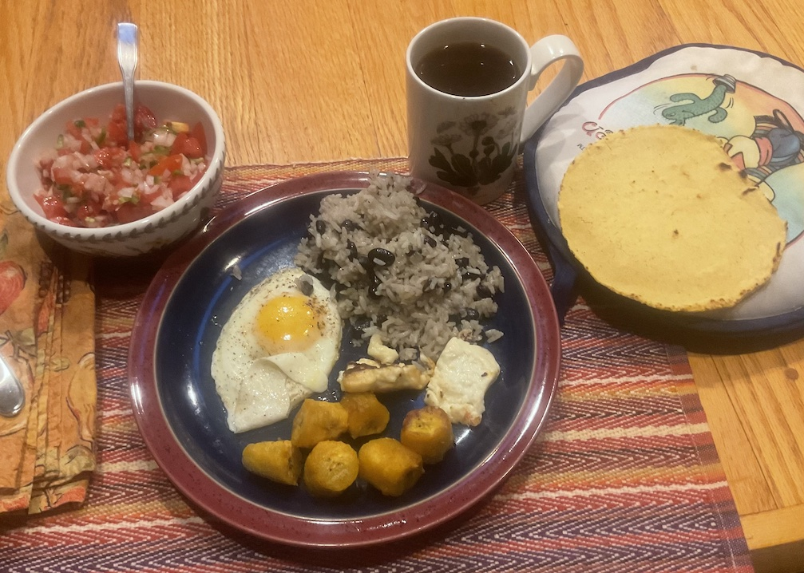

[prev](new_zealand.md)&emsp;
[top](../index.md)&emsp;
# Nicaragua
5 November, 2023

Nicaraguan breakfast: desayuno typ&iacute;co (typical breakfast). In
my case, this consisted of gallo pinto (rice and beans), pico de
gallo, fried eggs, fried plantains, fried cheeese, and corn
tortillas.  Killer breakfast, but I don't see how this could really be
typical, with so many components. It was very good, including probably
the best corn tortillas I've ever made.

Recipes: 
[overview](https://www.mashed.com/1079937/what-a-typical-breakfast-looks-like-in-nicaragua/) 
[queso frito](https://www.nataknowsbest.com/nicaraguan-queso-frito/) 
[gallo pinto](https://www.seriouseats.com/gallopinto-nicaraguan-rice-and-beans-recipe) 
[tortillas](https://www.tasteofhome.com/article/how-to-make-corn-tortillas/) 
[pico de gallo](https://natashaskitchen.com/pico-de-gallo/)

