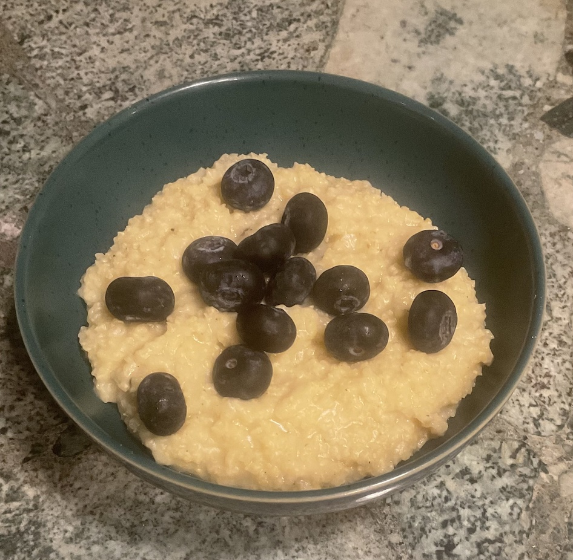

[prev](nicaragua.md)&emsp;
[top](../index.md)&emsp;
# Niger
12 November, 2023

Nigerien breakfast: millet porridge. What to say about porridge? This
was very satisfying, if a little simple. We both enjoyed it. I could
not figure out what fruit was authentic on this dish, because all the
recipes for it were written so that they'd be easy to make in other
parts of the world, so they just said things like "fruit, berries, or
nuts". So I picked blueberries, because I like blueberries.

[recipe](https://recipes.net/cuisine/african/african-side-dishes/african-millet-porridge/)

