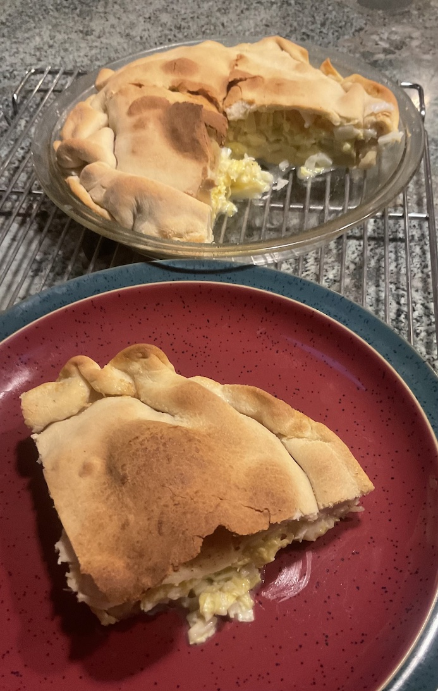

[prev](nigeria.md)&emsp;
[top](../index.md)&emsp;
[next](norway.md)
# North Macedonia
26 November, 2023

Macedonian breakfast: zelnik. Basically cabbage pie.  We liked this
more than we expected. It has a very high fat content, and I think
that made it more interesting than it would otherwise have been.  No
plans to move to North Macedonia, though.

I think I misunderstood the instructions in the recipe, so I didn't
get the pastry layers I was supposed to.

[recipe](https://thefoodhog.com/zelnik-recipe/)

