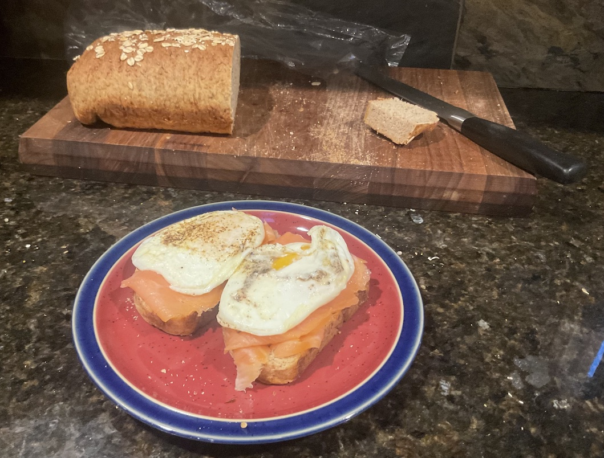

[prev](north_macedonia.md)&emsp;
[top](../index.md)&emsp;
# Norway
3 December, 2023

Norwegian breakfast: Laks og Egger&oslash;re. Toast, smoked salmon,
fried eggs. One of the easist breakfasts I've made on this project,
and oh so tasty.

The bread is fanstastic. I think I left my dough a little
under-hydrated, so I didn't get the rise or oven spring I was hoping
for, but it was delicious.

Recipes: 
[Laks og Egger&oslash;re](https://nomadsunveiled.com/norwegian-breakfast-in-norway/)
(not really a recipe, just a description) 
[Norwegian brown bread](https://true-north-kitchen.com/norwegian-brown-bread-with-oats-and-rye/) 

