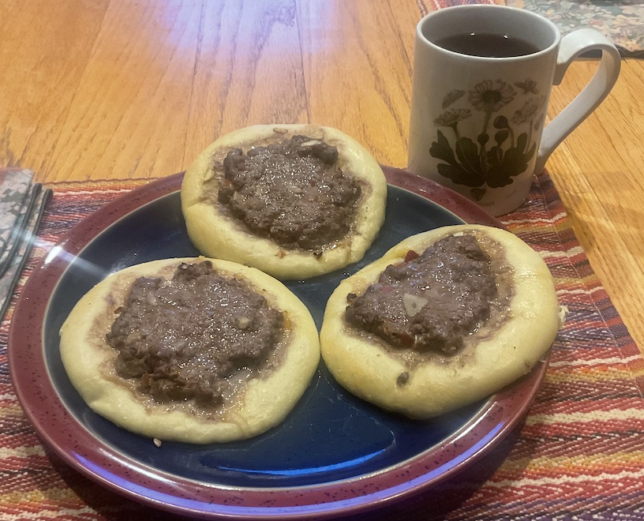

[prev](palau.md)&emsp;
[top](../index.md)&emsp;
# Palestine
31 December, 2023

Palestinian breakfast: fatayer. Basically a no-sauce pizza, with
middle-eastern spices. (I didn't do the cheese version because it was
going to be difficult to scale down to two servings.) These were
fantastic. I think two apiece would have been plenty.

Would definitely make this again.

[recipe](https://www.kingarthurbaking.com/blog/2021/04/09/fatayer-pie-middle-east-ramadan) 

Possibly the most tedious video on youtube: 
[pronounciation](https://www.youtube.com/watch?v=1hgSJWr6QHk)

