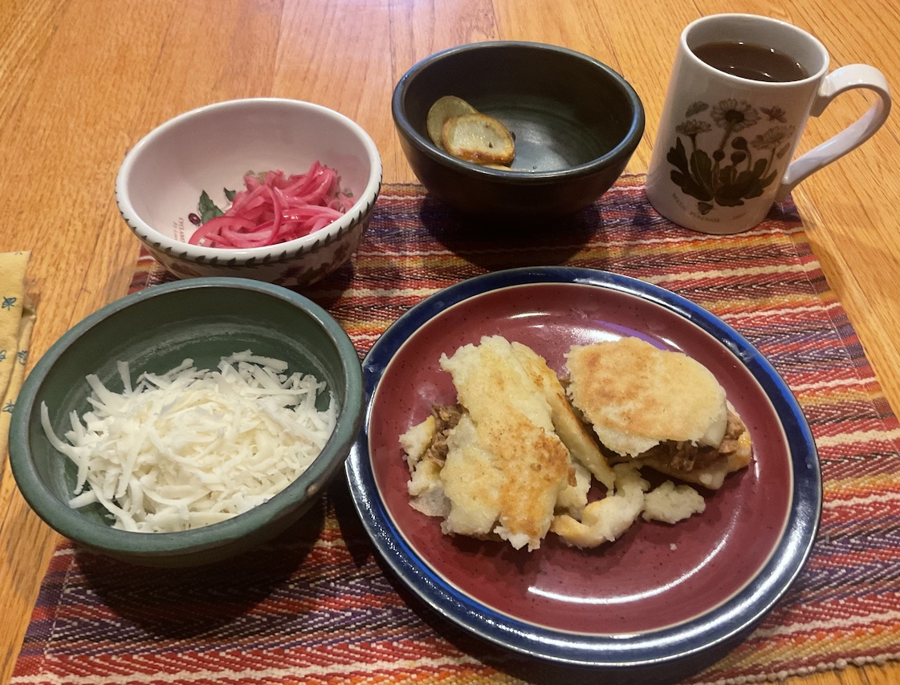

[prev](palestine.md)&emsp;
[top](../index.md)&emsp;
[next](papua_new_guinea.md)
# Panama
7 January, 2024

Panamanian breakfast: arepas, with pickled red onion, carnitas,
cotija, and saut&eacute;ed sweet potato filling. This was so good. Not sure
why, but it didn't quite cook through properly. Maybe I made them too
thick? Not sure. But the result was delicious, and I will definitely
be making these again.

I did the carnitas on the stovetop instead of a slow cooker, but it
came out great. Sadly, there's a bunch extra, so I'm forced to eat it
for dinners this week.

Recipes: 
[Arepas](https://pinchofyum.com/arepas) 
[Carnitas](https://pinchofyum.com/easy-crockpot-carnitas) 

