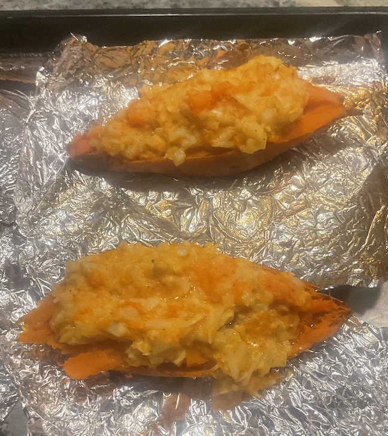

[prev](panama.md)&emsp;
[top](../index.md)&emsp;
[next](paraguay.md)
# Papua New Guinea
14 January, 2024

Papuan breakfast: coconut kau kau. This is very similar to twice-baked
potatoes, but with a tropical note that comes from the coconut.  Very
tasty.

The produce at the store where I shop is often very large, so "half an
onion" was probably too much.  I wish recipe authors would use mass or
(less preferably) volume instead of counts for produce.  Ok, rant
over.

[Recipe](https://www.196flavors.com/papua-new-guinea-coconut-kau-kau/)

