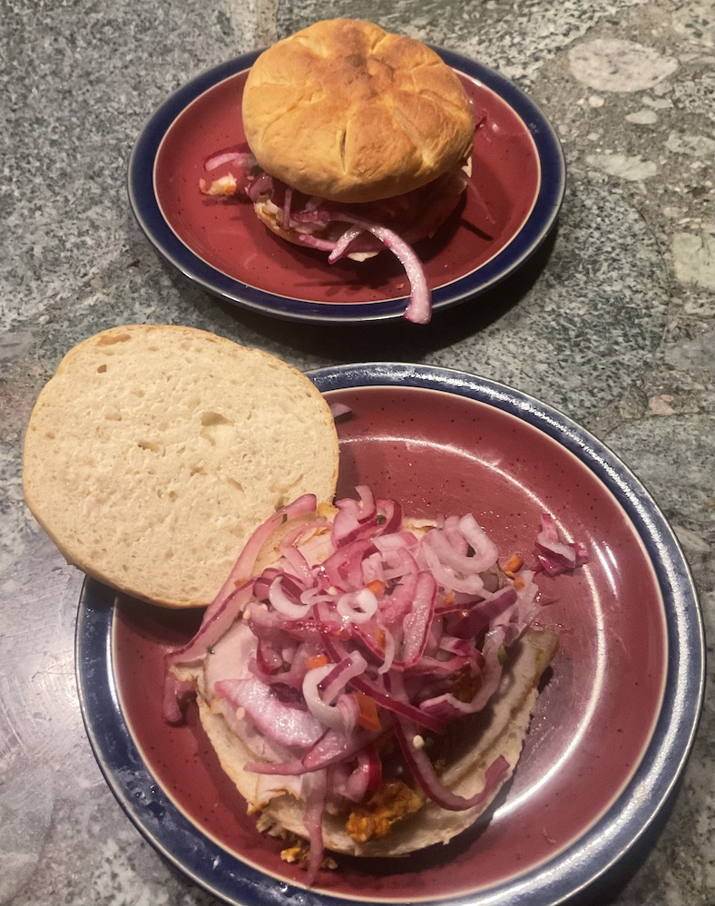

[prev](paraguay.md)&emsp;
[top](../index.md)&emsp;
# Peru
28 January, 2024

Peruvian breakfast: butifarra sandwich. This was a saga. The end
result was delicious, but I think I chose the absolute most difficult
way to prepare. The Jam&oacute;n de Pa&iacute;s required chicken
stock, so I spent four hours making that. Then the pork had to stew in
that for an hour and a half, and finally braise in the oven. So that
was all day Saturday.

In addition, the rolls recipe I found was the absolute worst. The
folding steps were constantly described as "too complicated to write
down, just check the video". As far as I could tell, though, there was
no video. &lt;eye-roll&gt;. Finally, she said to cook it at 500&deg;F
for 25 minutes. It was overdone after 10 minutes. Also note that in
the photos for the sandwich, he does not show the rosette rolls that
the recipe calls for. Sheesh.

Would definitely eat this again, but certainly choose a different
roll recipe.

Recipes: 
[sandwich](https://blog.amigofoods.com/index.php/peruvian-foods/butifarra/) 
[Jam&oacute;n de Pa&iacute;s](https://www.thespruceeats.com/jamon-del-pais-peruvian-ham-recipe-3029538) 
[rosette rolls](https://www.10cookings.com/2022/11/rosette-di-pane-rosette-bread-rolls.html)
**DO NOT USE THIS RECIPE**

