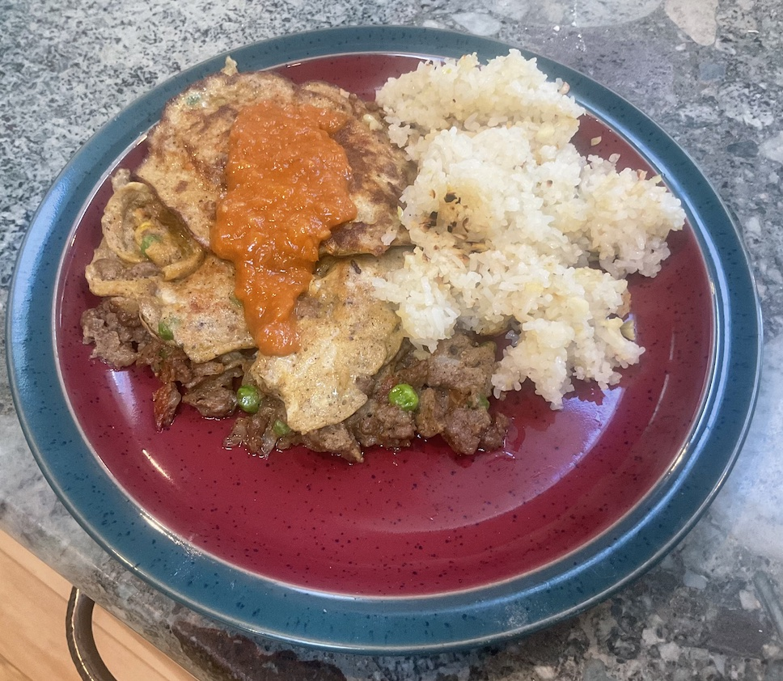

[prev](peru.md)&emsp;
[top](../index.md)&emsp;
# Philippines
4 February, 2024

Filipino breakfast: Tortang Ginling with garlic fried rice and banana
ketchup. This was an excellent breakfast. I enjoyed every bite, and
would happily eat this again. The pancakes (tortang), especially, were
extremely enjoyable.

You could make the banana ketchup to have with other things; it seems
quite versatile. It would go well, I think, on anything that you use
tomato ketchup for. And it's super easy!

Recipes: 
[tortang ginling](https://www.curiouscuisiniere.com/tortang-giniling/) 
[garlic fried rice](https://www.curiouscuisiniere.com/garlic-fried-rice/) 
[banana ketchup](https://www.curiouscuisiniere.com/banana-ketchup/) 

