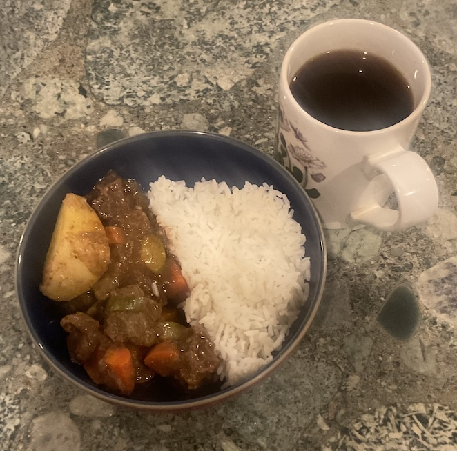

[prev](../p/portugal.md)&emsp;
[top](../index.md)&emsp;
# Qatar
25 February, 2024

Qatari breakfast: thareed. Very interesting food, tasted
delicious. Does not fit my American conception of breakfast, so it was
a little strange from that perspective.  Easy to make, reheated well
so it can be made the previous day. Flavors were sort of traditional
middle-eastern (as I understand them) and very well balanced.  The
serving size was a little off; I made what they called two servings,
and it turned into more like 4.

Does not pair especially well with the coffee we were drinking, but I
would definitely make this again for dinner.

[recipe](https://feastfulfork.com/thareed/) 

