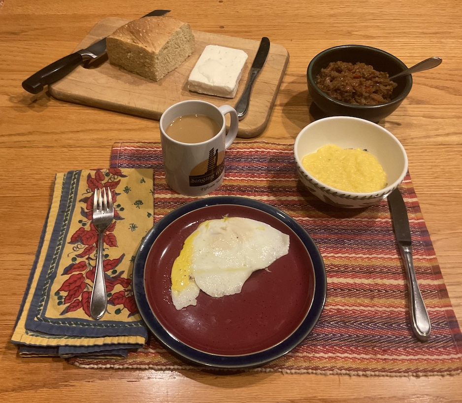

[prev](../q/qatar.md)&emsp;
[top](../index.md)&emsp;
# Romania
3 March, 2024

Romanian breakfast: eggs, zacusca spread, bread, mamaliga, and
cheese. Wasn't able to source the proper Romanian cheese, but my
reading suggested that feta was a near miss. Zacusca and bread were
made the previous day, so this all went pretty smoothly. The mamaliga
recipe's timings seemed way off; it was done far earlier than they
suggested.

Overall, this was a very satisfying breakfast. I like the many
components aspect, and the zacusca was amaze-balls delicious. The feta
paired very well with the mamaliga and the zacusca. Super entry to the
world of breakfasts.

Recipes: 
[overview](https://www.mashed.com/1060922/what-a-typical-breakfast-looks-like-in-romania/) 
[bread](https://www.thespruceeats.com/romanian-country-bread-recipe-1137263) 
[zacusca (eggplant spread)](https://www.chilipeppermadness.com/recipes/zacusca/) 
[mamalinga (polenta)](https://www.thespruceeats.com/romanian-cornmeal-porridge-recipe-mamaliga-1137442) 

