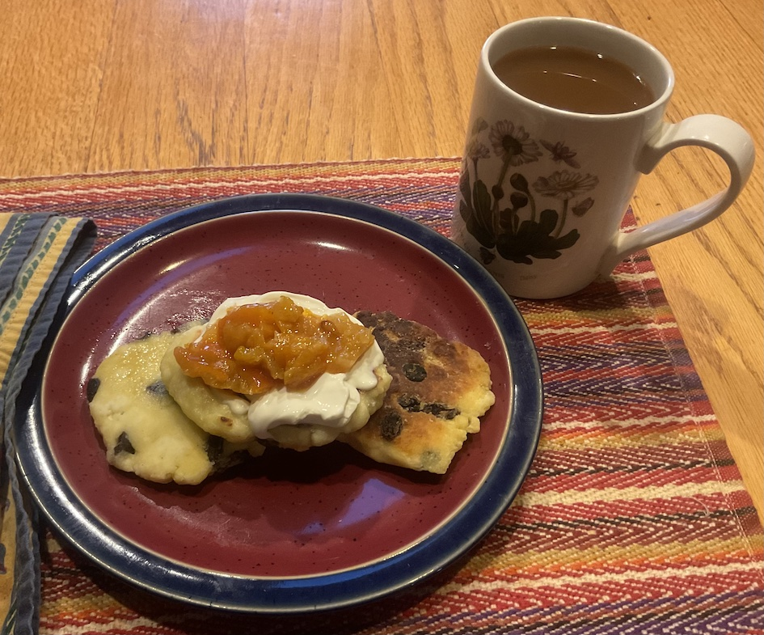

[prev](romania.md)&emsp;
[top](../index.md)&emsp;
[next](rwanda.md)
# Russia
10 March, 2024

Russian breakfast: syrniki. These were fabulous. Would definitely make
them again. They are mostly made of farmer's cheese, with a little egg
and flour mixed in to make them hold together.  Looked small on the
plate, but we each got 1/4 pound of cheese, which was plenty.

I think berries are more traditional as the topping, but I had the
tangerine marmalade already, and it really worked well.

Recipes: 
[syrniki](https://www.babaganosh.org/syrniki-russian-cheese-pancakes/) 
[farmer's cheese](https://www.thespruceeats.com/how-to-make-farmers-cheese-591547) 
[maralade](https://www.food.com/recipe/tangerine-marmalade-439775) 

