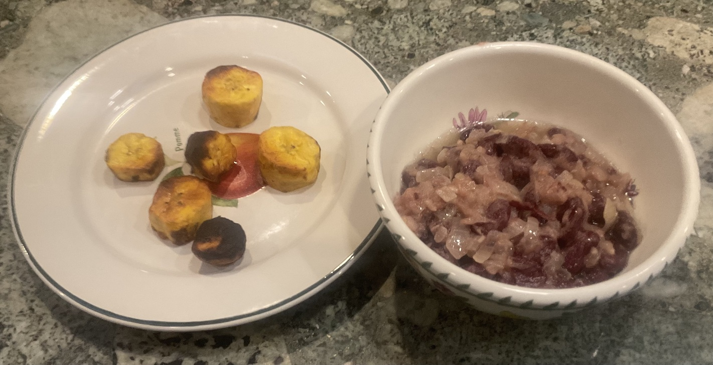

[prev](russia.md)&emsp;
[top](../index.md)&emsp;
# Rwanda
17 March, 2024

Rwandan breakfast: ibiharage with fried plantains. Very simple
preparation, but very satisfying. We both enjoyed this a
lot. Basically, it's just kidney beans and onions fried in oil, but
surprisingly satisfying.

[recipe](https://blog.remitly.com/lifestyle-culture/nationaldishes-ibiharage-burundi-national-dish)

