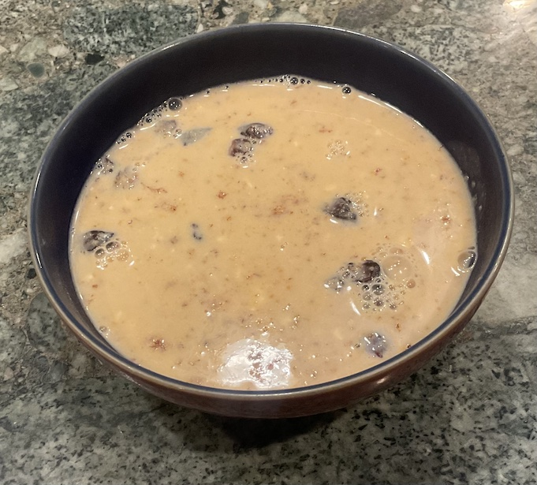

[prev](../r/rwanda.md)&emsp;
[top](../index.md)&emsp;
# Saint Kitts and Nevis
24 March, 2024

Kittitian breakfast: plantain porridge. This tasted OK, but it didn't
have much staying power. I was hungry again after two hours. It came
out more like a soup than a porridge, which was a little strange to
me. I think I would like it better if it was a little chewier.

[recipe](https://globalkitchentravels.com/haitian-plantain-porridge/)

