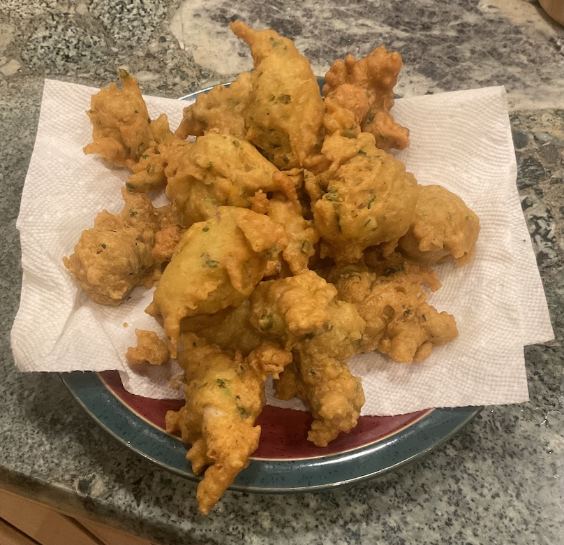

[prev](saint_lucia.md)&emsp;
[top](../index.md)&emsp;
# Saint Vincent and the Grenadines
7 April, 2024

Saint Vincentian breakfast: accra. Salt cod fritters. Yum! I made half
the recipe, turned out to be four servings, but who's complaining?

I am [forbidden](../a/antigua_and_barbuda.html) from making Carribian
style salt cod any more, so I tried a Spanish style for this one. It
takes 90 minutes instead of a week, and isn't nearly as stinky, but
the flavor is more muted, so you couldn't really taste it in the final
product.

Recipes: 
[salt cod](https://forkingfoodie.blogspot.com/2014/02/salt-cod-how-to-quickly-make-your-own.html) 
[accra](https://www.garlicandzest.com/accras-de-morue/) 

