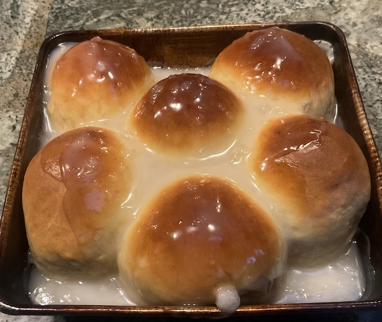

[prev](saint_vincent.md)&emsp;
[top](../index.md)&emsp;
# Samoa
14 April, 2024

Samoan breakfast: panipopo. Very similar to cinnamon buns. Two buns per
person is the perfect serving size, and the went very well with the
coffee we had. Pretty easy, but it does require getting up fairly
early so the dough can rise. Worth it.

[recipe](https://blog.polynesia.com/pani-popo-a-sticky-gooey-gotta-have-it-treat-from-samoa)

