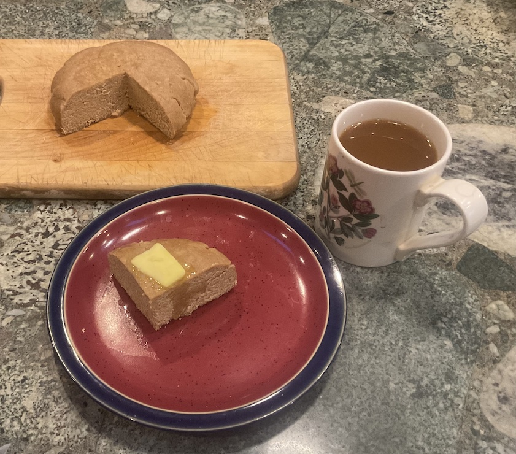

[prev](san_marino.md)&emsp;
[top](../index.md)&emsp;
# S&atilde;o Tom&eacute; and Principe
28 April, 2024

S&atilde;o Tom&eacute;an breakfast: cuscuz. A corn cake flavored with
sugar and cinnamon. It was quite tasty, though mine came out a little
dense. The cooking technique requires forcing steam through the cake
to cook it, and I wasn't able to do that with the kitchenware at my
disposal. So mine isn't nearly as fluffy as the one in the recipe, but
it was cooked through and very tasty. Pairs very well with coffee.

[recipe](https://www.crumbsnatched.com/traditional-cape-verdean-cuscus-cuscus-de-milho/)

