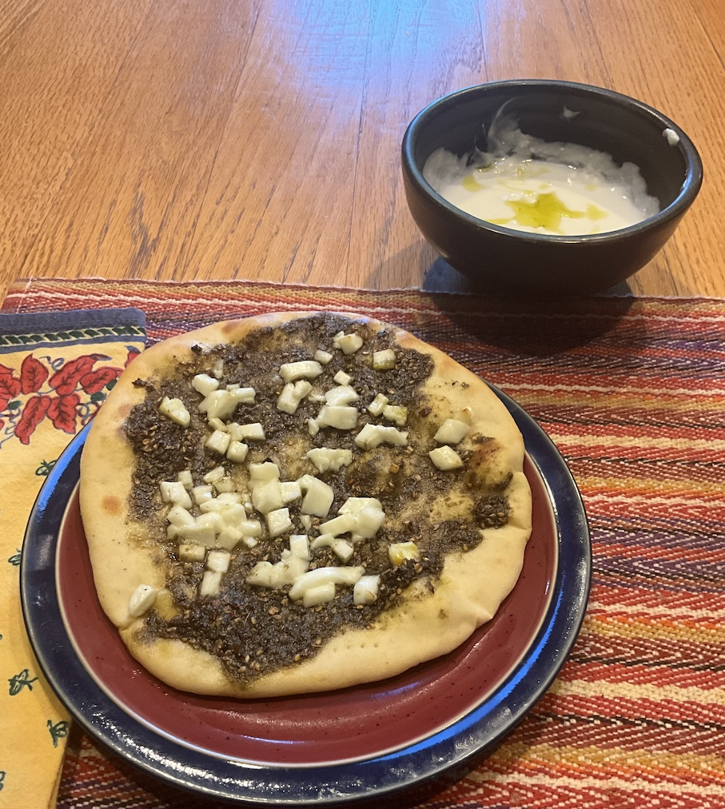

[prev](sao_tome.md)&emsp;
[top](../index.md)&emsp;
# Saudi Arabia
5 May, 2024

Saudi breakfast: za'atar bread with yogurt dipping sauce. It's a
flatbread, with a za'atar paste. I included haloumi and red pepper
flakes as optional toppings. The dippping sauce was supposed to be
labneh, but I didn't read the recipe before hand. Turns out that's a
kind of cheese made from yogurt, and I didn't have time to put it
together, so I improvised.

This was an awesome breakfast, and I expect I'll be repeating it at
some point.

[recipe](https://www.alphafoodie.com/middle-eastern-zaatar-bread-manakish-zaatar/)

