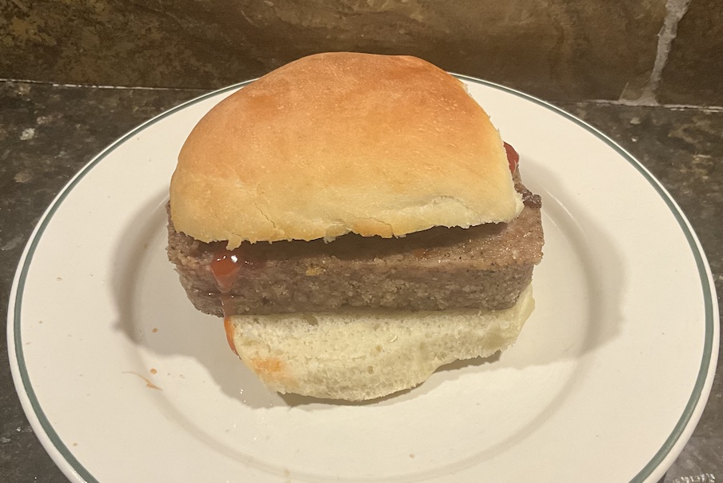

[prev](saudi_arabia.md)&emsp;
[top](../index.md)&emsp;
[next](senegal.md)
# Scotland
9 March, 2025

Scottish breakfast: breakfast buns with lorne sausage. I did all the
work for this yesterday, so this morning was a breeze. This was very
tasty, along the lines of an American breakfast sandwich. The lorne
sausage had some interesting spices in it, though. Very easy to make,
highly recommended.

Recipes: 
[sausage](https://scottishscran.com/lorne-sausage-recipe/) 
[buns](https://scottishscran.com/scottish-morning-rolls-recipe/) 

