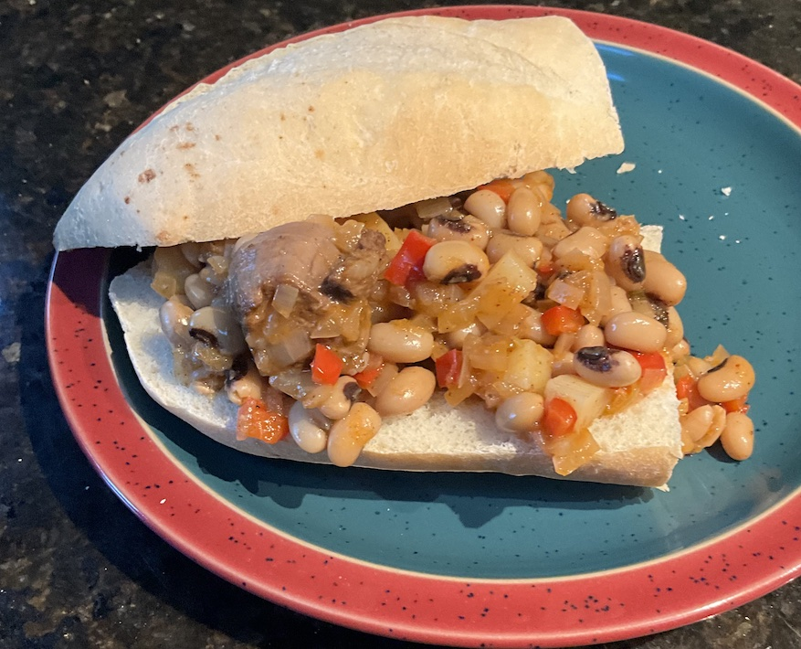

[prev](saudi_arabia.md)&emsp;
[top](../index.md)&emsp;
# Senegal
12 May, 2024

Senegali breakfast: ndambe. The sandwiches were delicious. The recipe
says it serves 4, but I think I could have easily made 6 sandwiches
with half the recipe. I'm not a fan of black eyed peas, so the
leftover stew is pretty unappealing. (You can't taste them inside the
sandwiches.) Fortunately, my wife will eat anything.

Recipes: 
[ndambe](https://www.saveur.com/recipes/ndambe-senegal-breakfast/) 
The baguettes were from Peter Reinhart's <i>The Bakers Apprentice</i>.

