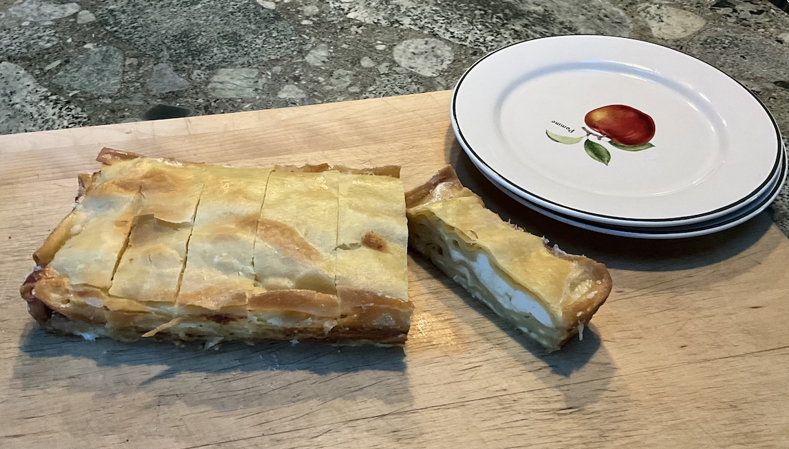

[prev](senegal.md)&emsp;
[top](../index.md)&emsp;
# Serbia
19 May, 2024

Serbian breakfast: sirnica. Phyllo cheese pie. This is pretty
involved, and I made it harder on myself by making the farmer's cheese
and the phyllo dough. The results were delicious, though. Quite
filling, neither one of us could eat more than two pieces at breakfast.

If you make it, note that you can make it a day ahead, and then reheat
it in the morning.  That way, you don't have to get up at 5 am like a
doofus.

Recipes: 
[phyllo dough](https://cooking.nytimes.com/recipes/1015957-basic-phyllo-dough) 
[farmer's cheese](https://www.thespruceeats.com/how-to-make-farmers-cheese-591547) 
[sirnica](https://balkanlunchbox.com/phyllo-cheese-pie-slagana-sirnica-recipe/)

