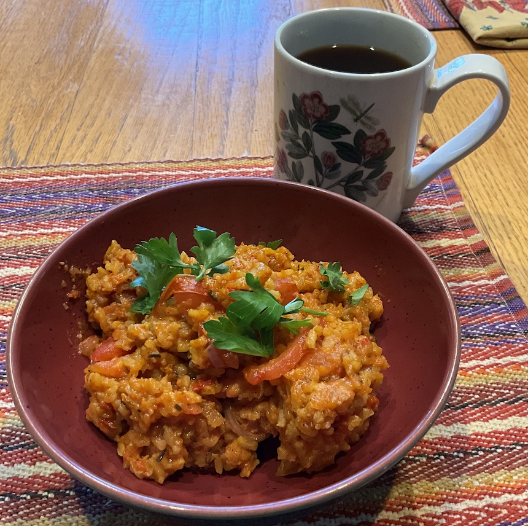

[prev](seychelles.md)&emsp;
[top](../index.md)&emsp;
# Sierra Leone
2 June, 2024

Sierra leonean breakfast: jallof rice. Made half the recipe, which was
easily four servings. This is very similar to jambalaya, and (like
jambalaya) it can be with lots of different ingredients. This version
just uses vegetables in the rice mix (though there is chicken in the
stock), but it can be made with seafood, chicken, sausage, etc. We
both enjoyed it, though it was a little spicy for my wife.

[recipe](https://www.seriouseats.com/nigerian-jollof-rice-recipe-6741471)

