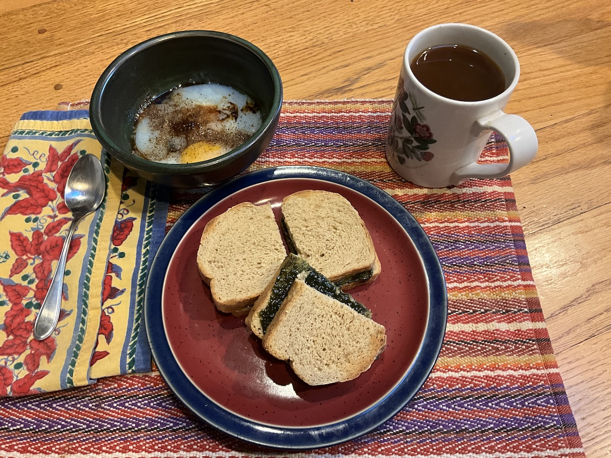

[prev](sierra_leone.md)&emsp;
[top](../index.md)&emsp;
# Singapore
9 June, 2024

Singaporean breakfast: soft-cooked eggs with kaya jam and toast. This
was super easy. I used the immersion circulator for the eggs, because
there was less guesswork. The result was absolutely delicious.

I didn't do the kaya jam properly, because I couldn't find coconut
cream (so used milk) and I didn't have the right sugar. Nonetheless,
it came out very tasty. I have to make it again with the proper
ingredients.

[recipe](https://www.seriouseats.com/singapore-style-soft-cooked-eggs-with-kaya-jam-and-toast-recipe) 
The bread is _Maryetta's Oatmeal Bread_ from James Beard's _Beard on Bread_.

