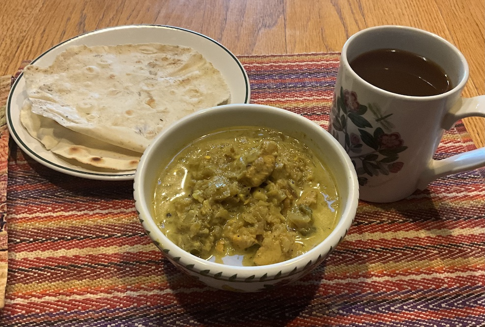

[prev](singapore.md)&emsp;
[top](../index.md)&emsp;
[next](slovakia.md)
# Singapore
16 March, 2025

Singaporean breakfast: Chicken curry with roti.  This was very
good. It's quite time consuming to make, so I made it yesterday
afternoon, and reheated it this morning. The flavors were excellent,
and the roti were the perfect accompaniment.

Recipes: 
[roti](https://www.awesomecuisine.com/recipes/9566/singapore-roti-prata/) 
[curry](https://www.awesomecuisine.com/recipes/631/chicken-curry/) 

