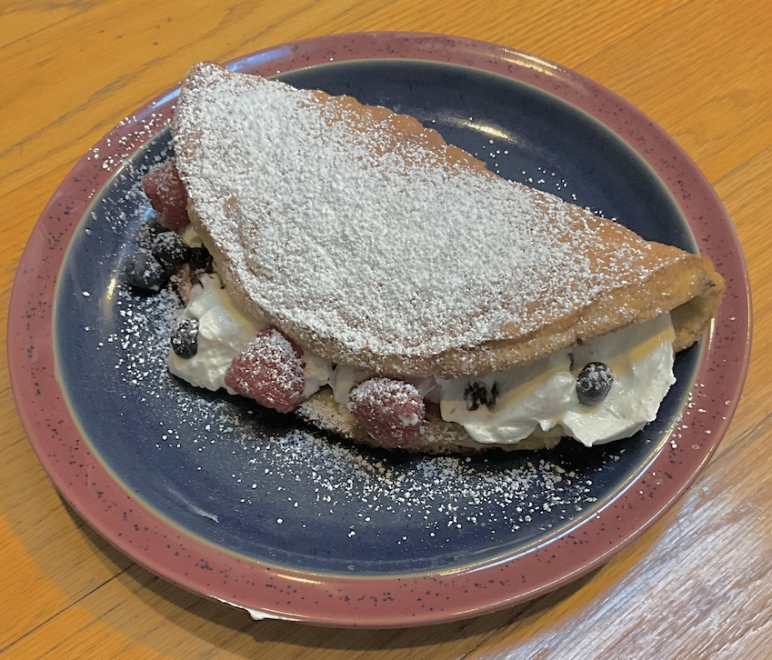

[prev](slovakia.md)&emsp;
[top](../index.md)&emsp;
# Slovenia
23 June, 2024

Slovenian breakfast: pohorje omelet. OMG, this was so good. Lots of
steps, but none of them hard, I think this is a very approachable
recipe. I couldn't find straight cranberry jelly, but I found some
cranberry/blueberry that worked just fine.

Wife was out of town, and the recipe looked tricky to cut in half, so
i had a double portion.  Didn't regret it as much as I expected to.

[recipe](https://www.foodandwine.com/pohorje-slovenian-sweet-omelet-7152597)

