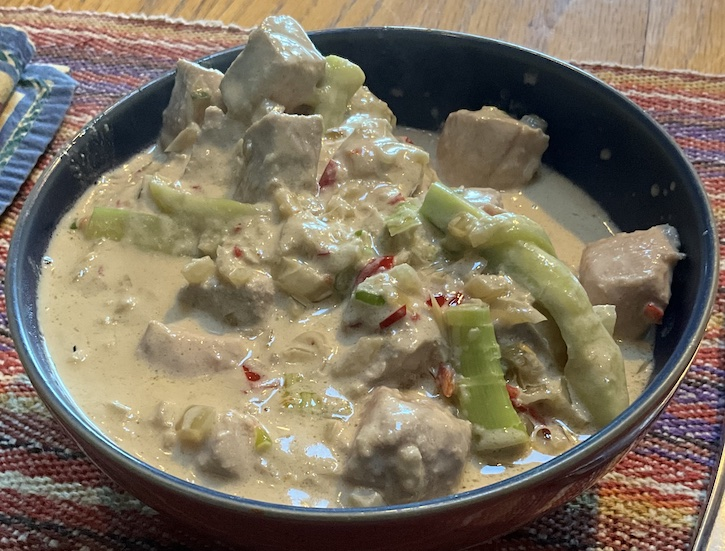

[prev](slovenia.md)&emsp;
[top](../index.md)&emsp;
# Solomon Islands
30 June, 2024

Soloman Islands breakfast: coconut tuna curry. Very easy to make,
comes together very quickly, and very tasty. My wife couldn't stop
eating it. Very rich, it definitely kept us going till lunch time.

Recipes 
[coconut rice](https://minimalistbaker.com/perfect-coconut-rice-with-a-secret-ingredient/) 
[tuna curry](https://www.internationalcuisine.com/tuna-coconut-curry/) 

