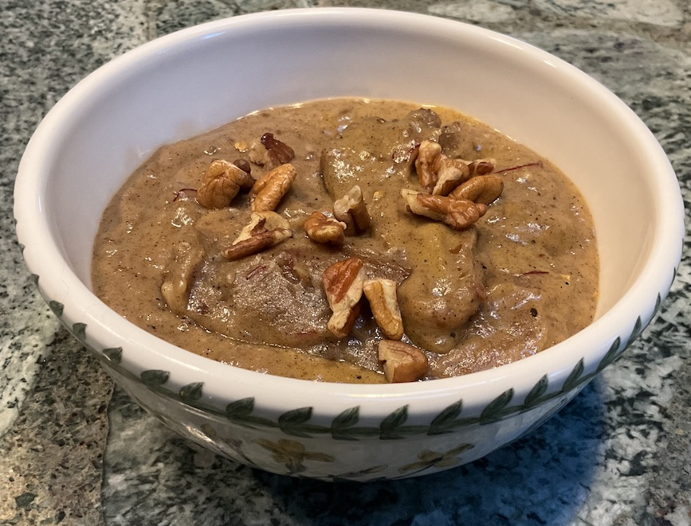

[prev](sudan.md)&emsp;
[top](../index.md)&emsp;
[next](suriname.md)
# South Sudan
11 August, 2024

South Sudanese breakfast: asida. This was a sweet dish, with the
consistency of porridge, heavy on the taste of dates, but with an
interesting spice mix. Very enjoyable.  The portion size suggested by
the recipe seemed small, so I made two servings apiece, and whoo! it
was way too much. But that just means left overs, and reader, we're
looking forward to them.

My wife thinks this would be better as a dessert than a
breakfast. She's probably right.

[recipe](https://ilovearabicfood.com/recipes/asida-with-dates-and-walnuts/)

