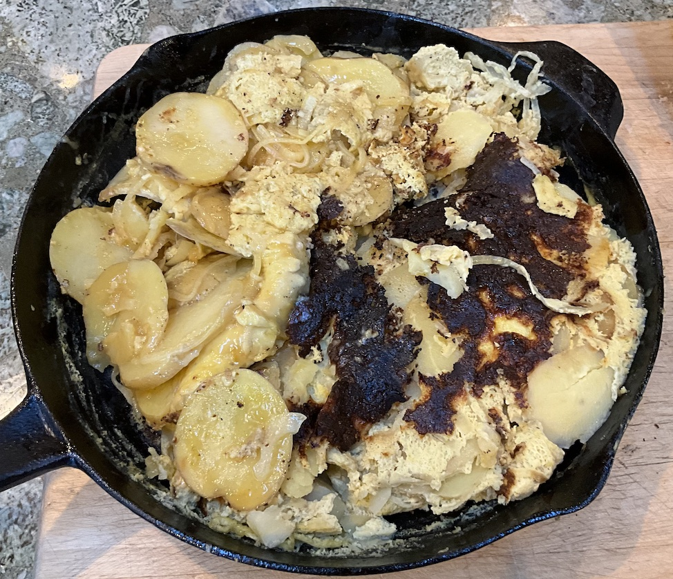

[prev](south_africa.md)&emsp;
[top](../index.md)&emsp;
[next](sri_lanka.md)
# Spain
21 July, 2024

Spanish breakfast: tortilla.  I obviously botched this badly. Too late
in the process, I saw a note that I should make two smaller tortillas
if this was my first time. The flipping step is quite tricky, and I
also unfortunately chose a very heavy cast iron pan that was bigger
than any plate I had. &#128580; The flipping step went horribly wrong,
and the results were, uh, not pretty.

But the flavor was excellent. I think I will try to make this again
some day with a smaller lighter pan.

[recipe](https://spanishsabores.com/best-spanish-omelet-recipe/)

