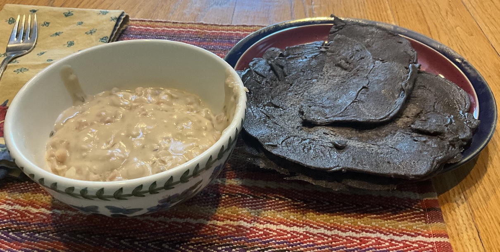

[prev](sri_lanka.md)&emsp;
[top](../index.md)&emsp;
[next](south_sudan.md)
# Sudan
4 August, 2024

Sudanese breakfast: ful medames with kisra. Couldn't find some of the
ingredients so the kisra (the pancake) was made with buckwheat instead
of sorghum, and the ful was made with plain white beans instead of
fava beans. But it tasted great, and boy, was it filling. It's more
than an hour after I normally have lunch, and I'm still not hungry.

I don't know if it was because of the flour change or what, but the
kisra were far easier to form than the recipe suggested.

Recipes: 
[ful medames](https://www.seriouseats.com/ful-mudammas-egyptian-breakfast-fava-beans-recipe) 
[kisra](https://afrifoodnetwork.com/recipes/kisra/) 

