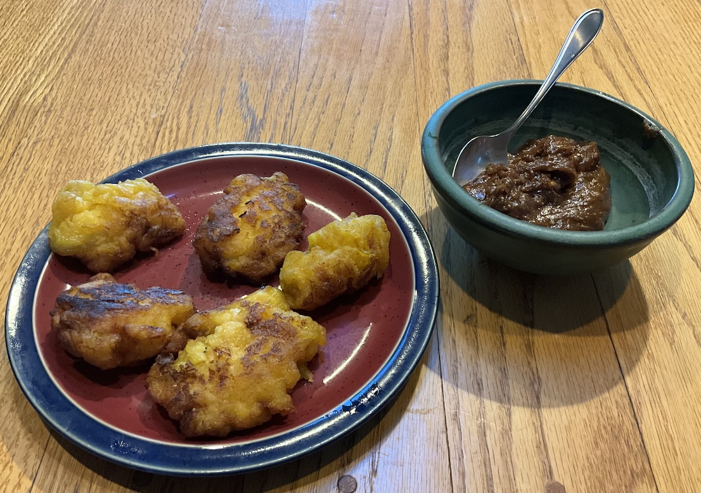

[prev](south_sudan.md)&emsp;
[top](../index.md)&emsp;
[next](sweden.md)
# Suriname
18 August, 2024

Surinamese breakfast: teloh. Basically, mashed plaintains, shallow
fried for a crispy exterior.  Very simple to prepare, goes quickly,
and quite a satisfying result.

The peanut sauce is stolen from another Surinamese recipe, with some
substitutions for hard-to-find ingredients. I used ginger in place of
the galangal, and a soy sauce honey mixture in place of the kecap mania.

Recipes 
[peanut sauce](https://globalkitchentravels.com/ramadan-around-the-world-surinamese-bakabana-with-peanut-sauce/) 
[teloh](https://surinamedude.com/traditional-surinamese-breakfast-foods-to-start-your-day/) 

