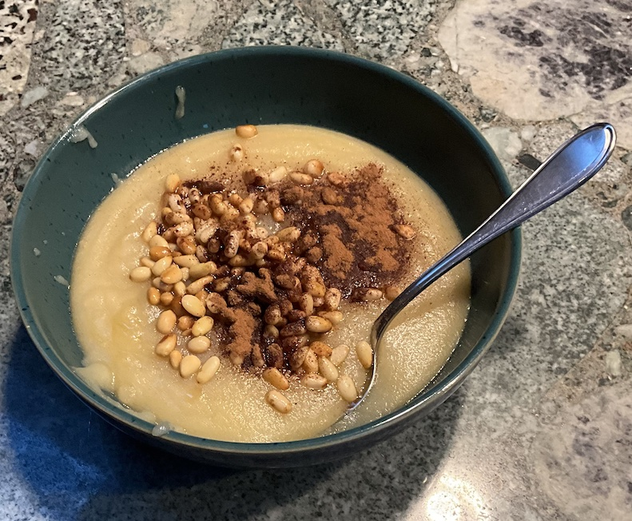

[prev](switzerland.md)&emsp;
[top](../index.md)&emsp;
# Syria
8 September, 2024

Syrian breakfast: mamounia. Super easy to make, but really on the
sweet side. (It's also eaten as dessert.) Overall flavor was great,
though. This one would be a good one to try if you're nervous about
your cooking skills.

[recipe](https://www.196flavors.com/syria-mamounia-mamounieh/)

