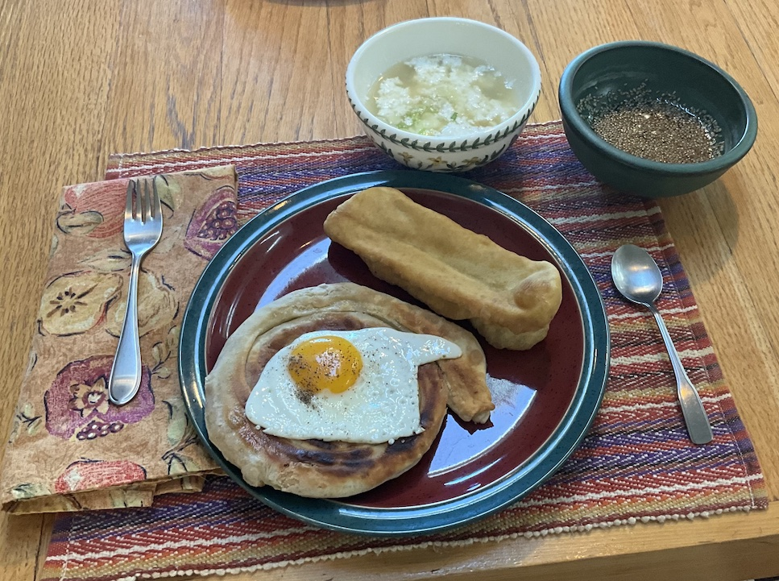

[prev](../s/syria.md)&emsp;
[top](../index.md)&emsp;
# Taiwan
15 September, 2024

Taiwanese breakfast: Dou Jiang, Cong You Bing, fried egg. Whoof. This
was a slog. It took 2&frac12; hours to make, so we had it at lunch
time. The oblong tan object is a chinese doughnut, which was a
suggested go-along for the Cong You Bing (scallion pancake). The brown
liquid was a pancake dipping sauce, and the white gloppy liquid was a
Dou Jiang (milk soup).

I would say this was pretty good (the dipping sauce was the highlight
for me), but it was way too much food.

Recipes 
[Cong You Bing](https://www.greedygirlgourmet.com/taiwanese-green-onion-pancake-cong-you-bing/) 
[Chinese doughnut](https://redhousespice.com/chinese-doughnut-stick/) 
[Dou Jiang](https://whattocooktoday.com/xian-dou-jiang.html) 

