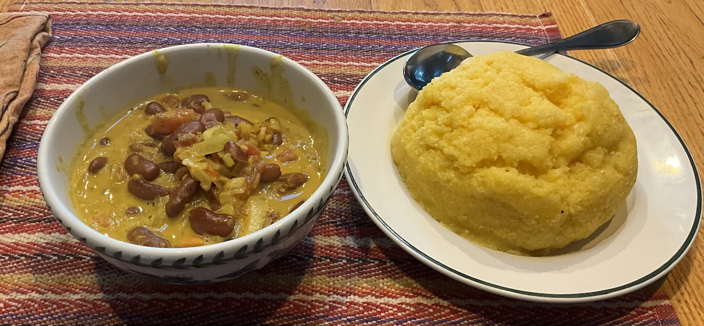

[prev](tajikistan.md)&emsp;
[top](../index.md)&emsp;
[next](tasmania.md)
# Tanzania
29 September, 2024

Tanzanian breakfast: ugali and beans. The beans were very similar to a
red kidney bean curry that I'm rather fond of, called rajma masala.
And the ugali is very reminiscent of a dish from souther Africa called
Sadza. (We know it in our household because my wife is an avid student
of Zimbabwean music.)

It was very filling, but the flavors were a little muted for my
tastes. If I make this again, I think I'll have to kick up the spices
a bit.

Recipes 
[ugali](https://weeatatlast.com/ugali-recipe/) 
[maharge ya nazi (beans)](https://www.internationalcuisine.com/maharge-ya-nazi/) 

