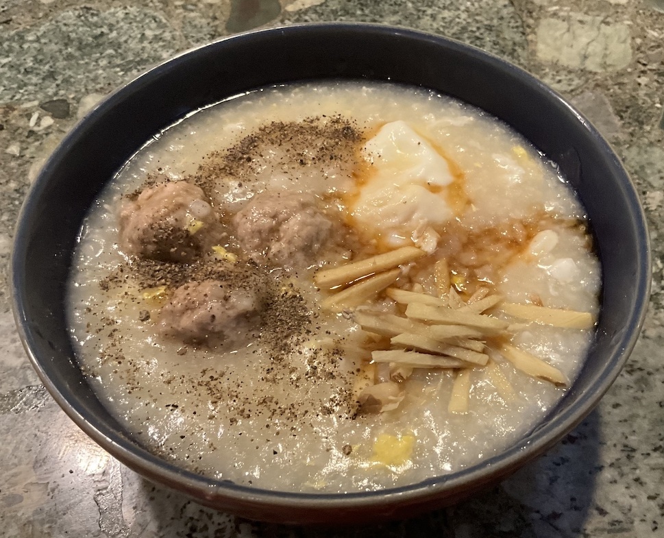

[prev](tasmania.md)&emsp;
[top](../index.md)&emsp;
[next](togo.md)
# Thailand
6 October, 2024

Thai breakfast: jok. This is a basic congee (rice porridge) with pork
meatballs, poached eggs, and various toppings.  It was delicious, and
the only thing that takes any time is cooking the rice, which can be
done the night before.  Quite a hearty breakfast.

The recipe says it makes five servings, but at 1/4 pound of pork and
two eggs, it felt more like two to me. If I did it again, I would
probably dial back the rice a bit, but otherwise it was scaled about
right for two adults.

[recipe](https://fearlesseating.net/thai-congee-breakfast/)

