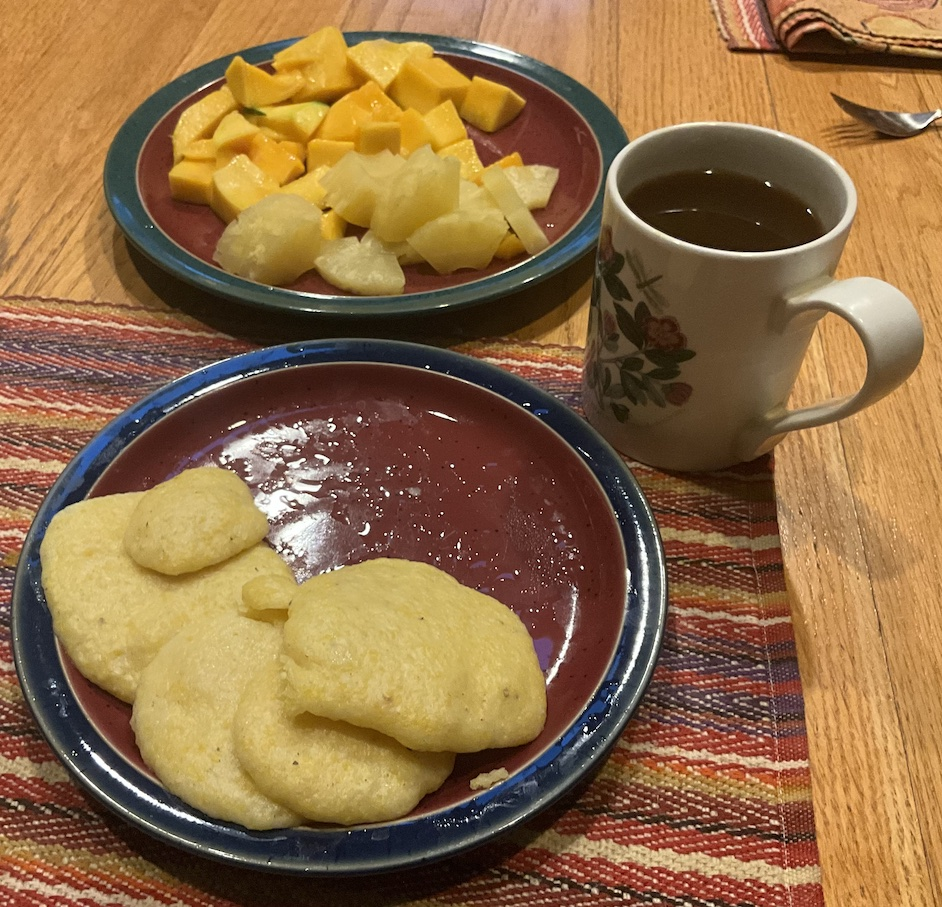

[prev](thailand.md)&emsp;
[top](../index.md)&emsp;
[next](tonga.md)
# Togo
13 October, 2024

Togolese breakfast: ablo, with mango and pineapple. Ablo is very
close to corn bread, with the addition of rice flour, and no egg
included. It was tasty, and went very well with the fruit. A nice breakfast.

Because this was a yeasted batter, I had to start making breakfast at
4am to allow for rising time. Oy.  Not a fan of that.

[recipe](https://www.veggiecuisines.com/west-african-cuisine/ablo-togolese-steamed-bread-recipebread-is-cherished-for-its-unique-texture-and-mild-flavor/)

