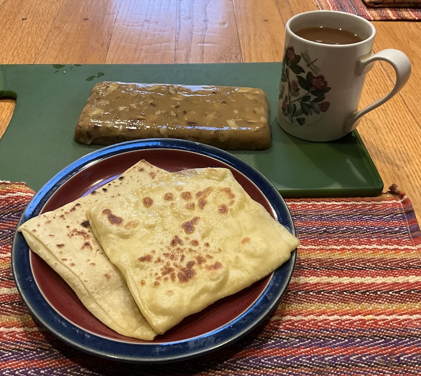

[prev](trinidad_and_tobago.md)&emsp;
[top](../index.md)&emsp;
# Tunisia
3 November, 2024

Tunisian breakfast: mlawi with halwa. Halwa (aka halva) is a mixture
of honey and tahini, with some almonds folded in. I'm not sure if
these are typically eaten together, but it worked amazingly well. We
ate them "taco style", and it was quite yummy.

Hardest part about the mlawi was that the recipe uses deciliters. That
provided a challenge at 5 am for someone who's used to thinking in
ounces.

Recipes: 
[mlawi](https://thetunisianway.com/homemade-tunisian-mlawi-recipe/) 
[halwa (I did the second version)](https://www.arabamerica.com/halawa-the-tahini-dessert/) 

